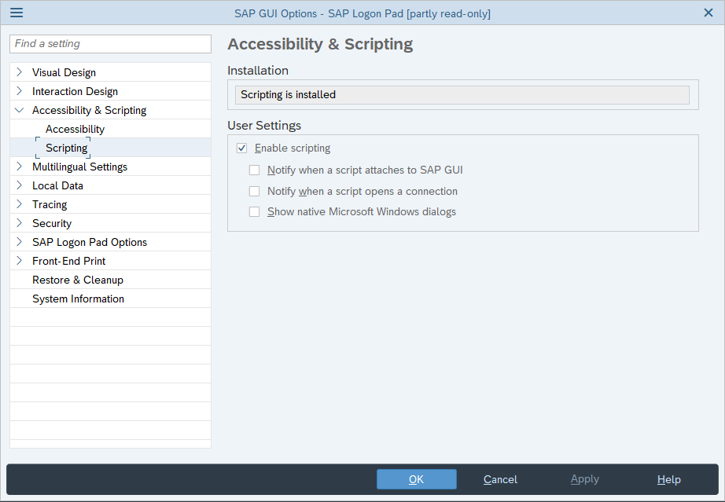
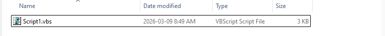
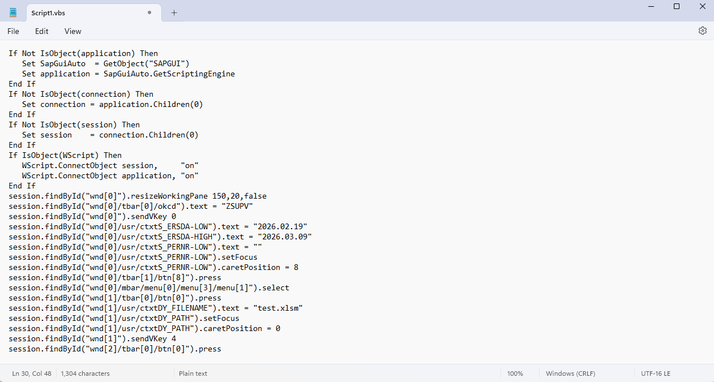

# SAP Recording Guide

This guide walks you through recording a SAP transaction and turning it into a Python script that works with `process_automation`.

---

## Step 1: Enable SAP Scripting

Open SAP and go to **Customize Local Layout** (the wrench icon) → **Options**.

Make sure **Enable Scripting** is checked and both notification checkboxes are unchecked:



---

## Step 2: Record Your Transaction

Still in SAP, go to **Customize Local Layout** → **Script Recording and Playback**.

Click **Record** and then perform your transaction as you normally would — fill in the selection screen, run the report, click the export menu, etc.


Stop the recording **after you click the export menu** but **before the file save dialog**. The `run_extract` engine handles the save dialog automatically.

---

## Step 3: Open the VBS File

When you stop the recording, SAP saves a `.vbs` file. Find and open it:



---

## Step 4: Copy the Script from Notepad

Open the `.vbs` file in Notepad. You'll see something like this:



Copy the lines that contain your actual transaction logic — everything between the transaction entry and the save dialog.

**What to copy (KEEP):**
- Selection screen fields (dates, filters, personnel numbers, etc.)
- The execute/run button press (`btn[8]`)
- The export menu clicks

**What NOT to copy (REMOVE):**
- The first 2 lines that enter the transaction code — `run_extract` does this for you
- Everything related to the file save dialog (filename, path, replace) — `run_extract` handles this too

---

## Step 5: Convert VBS → Python

The recording is in **VBScript**, but your script is in **Python**. The key difference: **Python requires parentheses `()` on every method call**.

In VBScript, method calls don't need parentheses:
```vb
session.findById("wnd[0]").sendVKey 0
session.findById("wnd[0]/tbar[1]/btn[8]").press
session.findById("wnd[0]/usr/ctxtFIELD").setFocus
session.findById("wnd[0]/mbar/menu[0]/menu[3]").select
```

In Python, **every function/method must be called with `()`**, otherwise Python treats it as a reference to the method object, not an actual call — nothing happens:
```python
# WRONG — these do nothing, they just reference the method without calling it
session.findById("wnd[0]").sendVKey 0        # SyntaxError
session.findById("wnd[0]/tbar[1]/btn[8]").press      # returns the method object, doesn't click
session.findById("wnd[0]/usr/ctxtFIELD").setFocus     # same — nothing happens

# CORRECT — parentheses actually execute the method
session.findById("wnd[0]").sendVKey(0)
session.findById("wnd[0]/tbar[1]/btn[8]").press()
session.findById("wnd[0]/usr/ctxtFIELD").setFocus()
session.findById("wnd[0]/mbar/menu[0]/menu[3]").select()
```

### Quick conversion rules

| VBScript | Python |
|---|---|
| `.sendVKey 0` | `.sendVKey(0)` |
| `.press` | `.press()` |
| `.setFocus` | `.setFocus()` |
| `.select` | `.select()` |
| `.selectContextMenuItem "&XXL"` | `.selectContextMenuItem("&XXL")` |
| `.text = "value"` | `.text = "value"` (no change — this is a property, not a method) |
| `.caretPosition = 8` | `.caretPosition = 8` (no change — property assignment) |

> **Rule of thumb:** If the line **does something** (clicks, presses, selects), add `()`. If it **sets a value** (`.text =`, `.caretPosition =`), leave it as-is.

---

## Step 6: Paste Into Your Script

Put your converted lines inside the `sap_script` function:

```python
from process_automation import run_extract

def sap_script(session):
    session.findById("wnd[0]/usr/ctxtS_ERSDA-LOW").text = "2026.01.01"
    session.findById("wnd[0]/usr/ctxtS_ERSDA-HIGH").text = "2026.03.09"
    session.findById("wnd[0]/tbar[1]/btn[8]").press()
    session.findById("wnd[0]/mbar/menu[0]/menu[3]/menu[1]").select()
    session.findById("wnd[1]/tbar[0]/btn[0]").press()

run_extract(sap_script,
    transaction="ZSUPV",
    export_format="xlsx",
    upload_to_sharepoint=True,
    template_path=r"Z:\path\to\TEMPLATE_DO_NOT_DELETE.xlsx",
    sharepoint_folder=r"Z:\path\to\sharepoint_folder",
)
```

---

## Summary

| Step | What to do |
|------|-----------|
| 1 | Enable scripting in SAP options |
| 2 | Record your transaction (stop before the save dialog) |
| 3 | Find the `.vbs` file SAP created |
| 4 | Open it in Notepad, copy the relevant lines |
| 5 | Add `()` to all method calls (press, select, setFocus, sendVKey) |
| 6 | Paste into `sap_script()` and call `run_extract()` |
