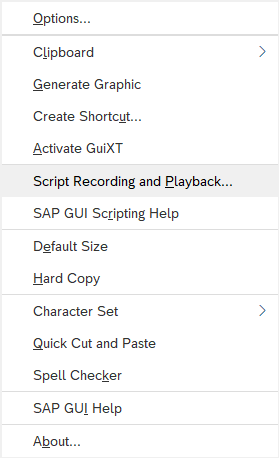
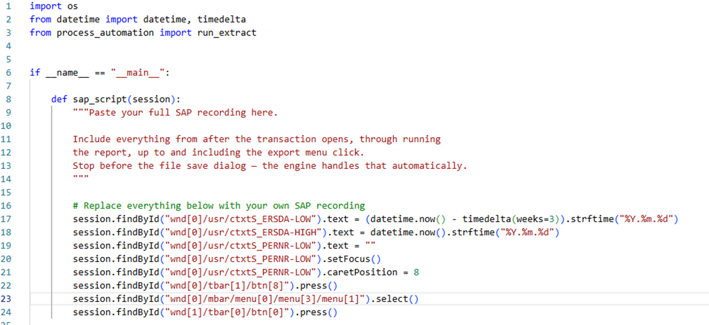
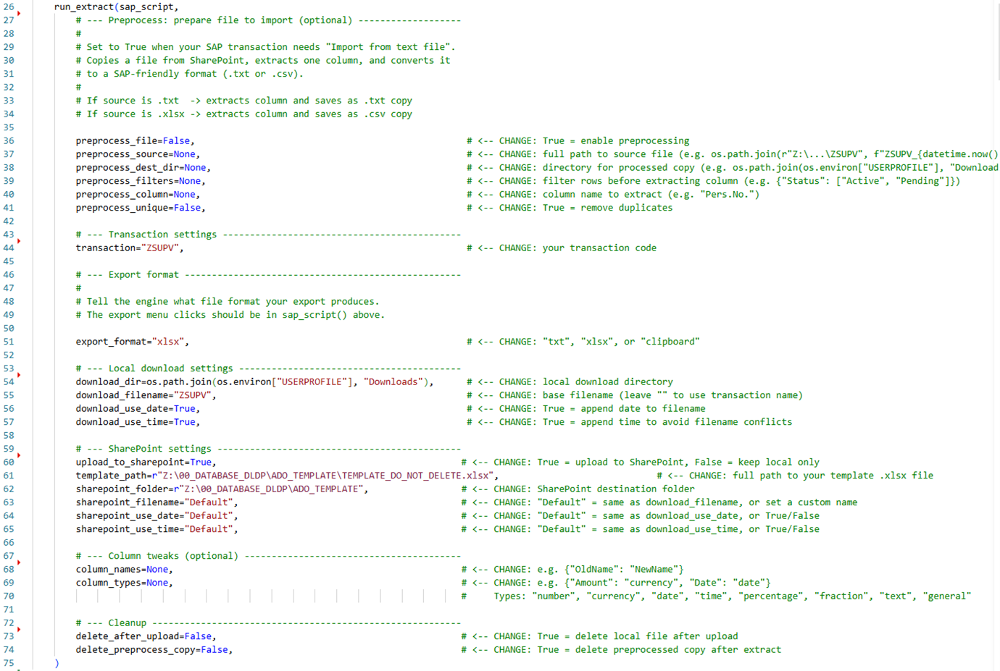
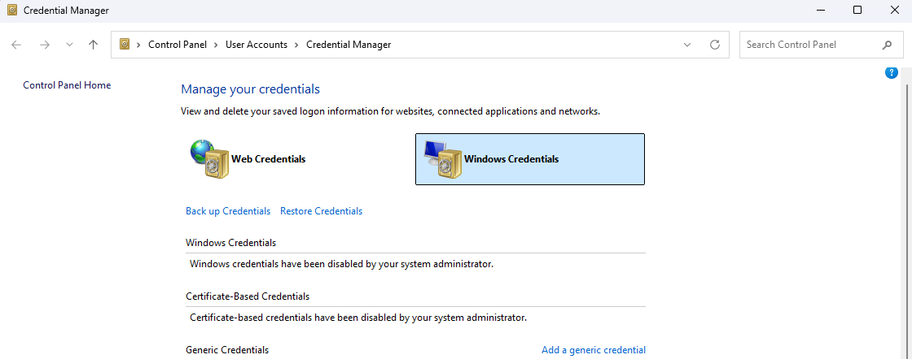

# SAP Recording Guide

This guide walks you through recording a SAP transaction and turning it into a Python script that works with `process_automation`.

---

## Step 1: Enable SAP Scripting

Open SAP and go to **Customize Local Layout** (the wrench icon) → **Options**.

Make sure **Enable Scripting** is checked and both notification checkboxes are unchecked:


---

## Step 2: Record Your Transaction

Still in SAP, go to **Customize Local Layout** → **Script Recording and Playback**.



Click **Record** and then perform your transaction as you normally would — fill in the selection screen, run the report, click the export menu, etc.


Stop the recording **after you click the export menu** but **before the file save dialog**. The `run_extract` engine handles the save dialog automatically.

---

## Step 3: Open the VBS File

When you stop the recording, SAP saves a `.vbs` file. Find and open it:


---

## Step 4: Copy the Script from Notepad

Open the `.vbs` file in Notepad. You'll see something like this:


Copy the lines that contain your actual transaction logic — everything between the transaction entry and the save dialog.

**What to copy (KEEP):**
- Selection screen fields (dates, filters, personnel numbers, etc.)
- The execute/run button press (`btn[8]`)
- The export menu clicks

**What NOT to copy (REMOVE):**
- The first 2 lines that enter the transaction code — `run_extract` does this for you
- Everything related to the file save dialog (filename, path, replace) — `run_extract` handles this too

---

## Step 5: Convert VBS → Python

The recording is in **VBScript**, but your script is in **Python**. The key difference: **Python requires parentheses `()` on every method call**.

In VBScript, method calls don't need parentheses:
```vb
session.findById("wnd[0]").sendVKey 0
session.findById("wnd[0]/tbar[1]/btn[8]").press
session.findById("wnd[0]/usr/ctxtFIELD").setFocus
session.findById("wnd[0]/mbar/menu[0]/menu[3]").select
```

In Python, **every function/method must be called with `()`**, otherwise Python treats it as a reference to the method object, not an actual call — nothing happens:
```python
# WRONG — these do nothing, they just reference the method without calling it
session.findById("wnd[0]").sendVKey 0        # SyntaxError
session.findById("wnd[0]/tbar[1]/btn[8]").press      # returns the method object, doesn't click
session.findById("wnd[0]/usr/ctxtFIELD").setFocus     # same — nothing happens

# CORRECT — parentheses actually execute the method
session.findById("wnd[0]").sendVKey(0)
session.findById("wnd[0]/tbar[1]/btn[8]").press()
session.findById("wnd[0]/usr/ctxtFIELD").setFocus()
session.findById("wnd[0]/mbar/menu[0]/menu[3]").select()
```

### Quick conversion rules

| VBScript | Python |
|---|---|
| `.sendVKey 0` | `.sendVKey(0)` |
| `.press` | `.press()` |
| `.setFocus` | `.setFocus()` |
| `.select` | `.select()` |
| `.selectContextMenuItem "&XXL"` | `.selectContextMenuItem("&XXL")` |
| `.text = "value"` | `.text = "value"` (no change — this is a property, not a method) |
| `.caretPosition = 8` | `.caretPosition = 8` (no change — property assignment) |

> **Rule of thumb:** If the line **does something** (clicks, presses, selects), add `()`. If it **sets a value** (`.text =`, `.caretPosition =`), leave it as-is.

---

## Step 6: Paste Into Your Script

The template is split into two blocs:

**Recording bloc** — your converted SAP session calls go inside `sap_script`:



**Config bloc** — `run_extract` is called with your transaction settings:



Here's the full example together:

```python
from process_automation import run_extract

def sap_script(session):
    session.findById("wnd[0]/usr/ctxtS_ERSDA-LOW").text = "2026.01.01"
    session.findById("wnd[0]/usr/ctxtS_ERSDA-HIGH").text = "2026.03.09"
    session.findById("wnd[0]/tbar[1]/btn[8]").press()
    session.findById("wnd[0]/mbar/menu[0]/menu[3]/menu[1]").select()
    session.findById("wnd[1]/tbar[0]/btn[0]").press()

run_extract(sap_script,
    transaction="ZSUPV",
    export_format="xlsx",
    upload_to_sharepoint=True,
    template_path=r"Z:\path\to\TEMPLATE_DO_NOT_DELETE.xlsx",
    sharepoint_folder=r"Z:\path\to\sharepoint_folder",
)
```

---

## Summary

| Step | What to do |
|------|-----------|
| 1 | Enable scripting in SAP options |
| 2 | Record your transaction (stop before the save dialog) |
| 3 | Find the `.vbs` file SAP created |
| 4 | Open it in Notepad, copy the relevant lines |
| 5 | Add `()` to all method calls (press, select, setFocus, sendVKey) |
| 6 | Paste into `sap_script()` and call `run_extract()` |

---

# SAP RFC Table Export (template_sap_rfc_export.py)

The recording guide above is for **SAP Transactions** — reports you run through the SAP GUI (ZSUPV, ME2N, IW39, etc.). For those, use `template_sap_pipeline.py`.

If you need to pull data directly from a **SAP Table** (KNA1, AFRU, AUFK, BKPF, etc.), use `template_sap_rfc_export.py` instead. This approach:

- **Does not require SAP GUI recording** — no VBS scripts, no screen automation
- **Reads SAP tables directly** via RFC (Remote Function Call)
- **Handles pagination automatically** — large tables are fetched in batches of 10,000 rows
- **Saves to CSV or XLSX** with optional date/time suffix in the filename

## Setup

### 1. Install the package

```
pip install process-automation
```

Or install in editable mode from the repo:

```
pip install -e path/to/process-automation
```

### 2. First run — SAP credentials

The first time you run the script, it will prompt you for your SAP credentials:

```
No credentials found. Please enter your SAP credentials.
User: your_sap_user
Password:
```

Your credentials are encrypted with Windows DPAPI and stored in **Windows Credential Manager** under the name `SAP_CREDENTIALS`. They are reused automatically on future runs.

### 3. If your credentials are wrong

**Option A — reset via command line:**

```
python -c "from process_automation import WinCredentialStore; WinCredentialStore.delete_credentials(); WinCredentialStore.save_credentials()"
```

This deletes the saved credentials and prompts you to enter new ones.

**Option B — reset via Windows Credential Manager:**

Open **Control Panel > User Accounts > Credential Manager**, click **Windows Credentials**, find `SAP_CREDENTIALS` under **Generic Credentials**, and remove it. The next run will prompt you again.



## Usage

Copy `template_sap_rfc_export.py` and fill in your table details:

```python
from process_automation import run_rfc_extract

run_rfc_extract({
    "table":      "AFRU",                          # SAP table name
    "cols":       "PERNR,AUFNR,VORNR,BUDAT",       # columns to fetch
    "filters":    ["BUDAT >= '20260301'"],          # WHERE conditions

    "output_dir":  r"Z:\your\output\folder",
    "output_name": "AFRU_export",                   # or None to use table name
    "extension":   "xlsx",                          # "csv" or "xlsx"
    "add_date":    True,                            # append _YYYYMMDD
    "add_time":    False,                           # append _HHMMSS
})
```

### Finding the right table and column names

SAP transactions often pull from multiple tables behind the scenes. If you know the transaction but not the underlying table, check SAP documentation or use the schema helper:

```python
from process_automation import save_table_schema

save_table_schema(
    table="AFRU",
    output_dir=r"C:\Temp",
    field_names="both",        # "technical", "label", or "both"
    show_example_row=True,
)
```

This outputs a CSV/XLSX with every field in the table: position, technical name, label, data type, length, and an example value.

### Chained export (two-step query)

Sometimes you need to query one table first to get filter values for a second table. For example, fetch order numbers from AUFK, then use them to pull confirmations from AFRU:

```python
run_rfc_extract({
    "chain": {
        "table": "AUFK", "cols": "AUFNR,OBJNR,WERKS,ERDAT",
        "filters": ["ERDAT >= '20260319'", "WERKS = '0005'"],
        "source_column": "AUFNR", "target_field": "AUFNR",
    },
    "table":      "AFRU",
    "cols":       "PERNR,AUFNR,VORNR,BUDAT",
    "filters":    [],
    "output_dir": r"C:\Temp",
    "extension":  "csv",
})
```

## SAP Transactions vs SAP Tables

| | `run_extract` (GUI) | `run_rfc_extract` (RFC) |
|---|---|---|
| **Template** | `template_sap_pipeline.py` | `template_sap_rfc_export.py` |
| **Use for** | SAP Transactions (ZSUPV, ME2N, IW39...) | SAP Tables (KNA1, AFRU, AUFK...) |
| **Requires** | SAP GUI + recording | SAP GUI installed (for COM) |
| **How it works** | Replays your screen recording | Reads the table directly via RFC |
| **Setup** | Record VBS, convert to Python | Just fill in table/columns/filters |
| **SharePoint** | Template-based upload workflow | Saves directly to SharePoint folder (auto check-in) |
